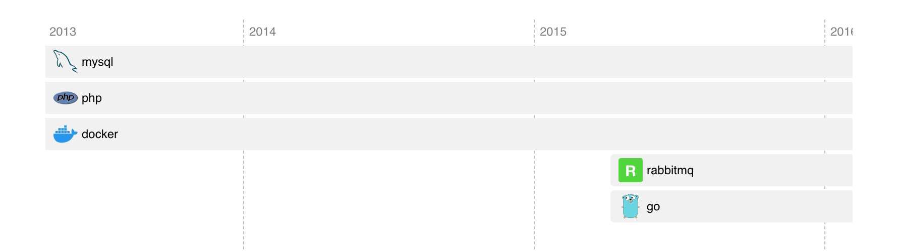

# Codersrank Timeline Widget

<!-- DOCS_START -->

Codersrank Timeline Widget is a web component that allows you easily integrate your work experience or portfolio information in a form of a timeline from your [CodersRank](https://codersrank.io) profile to your personal website:



## Install from NPM

Widget script available through NPM:

```
npm i @codersrank/timeline --save
```

After installation you need to import and register web component:

```js
import CodersrankTimeline from '@codersrank/timeline';

// register web component as <codersrank-timeline> element
window.customElements.define('codersrank-timeline', CodersrankTimeline);
```

## Install from CDN

Widget can also be downloaded or linked directly from CDN:

```html
<!-- replace x.x.x with actual version -->
<script src="https://unpkg.com/@codersrank/timeline@x.x.x/codersrank-timeline.min.js"></script>
```

In this case it is not required to register web component, it is already registered as `<codersrank-timeline>` element.

## Usage

As it is a web component the usage is pretty simple, just add widget HTML tag with your [CodersRank](https://codersrank.io) username

```html
<codersrank-timeline username="YOUR_USERNAME"></codersrank-timeline>
```

## Widget Attributes

Widget supports following properties as HTML element attributes:

| Name       | Type      | Default          | Description                                                        |
| ---------- | --------- | ---------------- | ------------------------------------------------------------------ |
| `username` | `string`  |                  | Your [CodersRank](https://codersrank.io) username                  |
| `type`     | `string`  | `workexperience` | Specify which data to show. Can be `workexperience` or `portfolio` |
| `branding` | `boolean` | `true`           | Displays "Powered by CodersRank" link                              |

For example:

```html
<codersrank-timeline username="YOUR_USERNAME" type="workexperience"></codersrank-timeline>
```

## Styling

It is possible to customize widget colors with CSS Custom Properties (CSS Variables) by setting them directly on the widget element with style attribute or in CSS.

There are following CSS Custom Properties are available:

| Property                      | Value                            |
| ----------------------------- | -------------------------------- |
| --preloader-color             | #72a0a8                          |
| --year-font-size              | 12px                             |
| --year-opacity                | 0.5                              |
| --year-height                 | 24px                             |
| --year-text-color             | currentColor                     |
| --year-line-color             | currentColor                     |
| --year-line-opacity           | 0.25                             |
| --timeline-item-bg-color      | #72a0a8                          |
| --timeline-item-text-color    | #fff                             |
| --timeline-item-font-size     | 12px                             |
| --timeline-item-padding       | 4px 8px                          |
| --timeline-item-border-radius | 4px                              |
| --tooltip-logo-size           | 32px                             |
| --tooltip-font-size           | 14px                             |
| --tooltip-width               | 320px                            |
| --tooltip-padding             | 16px                             |
| --tooltip-bg-color            | #fff                             |
| --tooltip-border-radius       | 4px                              |
| --tooltip-text-color          | #333                             |
| --tooltip-box-shadow          | 0px 10px 20px rgba(0, 0, 0, 0.1) |
| --tag-border                  | none                             |
| --tag-star-color              | #ff9900                          |
| --tag-bg-color                | rgba(0, 0, 100, 0.075)           |
| --tag-font-size               | 0.85em                           |
| --tag-font-weight             | bold                             |
| --tag-padding                 | 0.35em 0.57em                    |
| --tag-margin                  | 0.28em                           |
| --tag-border-radius           | 4px                              |
| --tag-text-color              | inherit                          |
| --branding-text-color         | inherit                          |

For example, to change year label font-size `14px`, add this to CSS stylesheet:

```css
codersrank-timeline {
  --year-font-size: 14px;
}
```

## Contribution

Yes please! See the [contributing guidelines](https://github.com/codersrank-org/timeline-widget/blob/master/CONTRIBUTING.md) for details.

## Licence

This project is licensed under the terms of the [MIT license](https://github.com/codersrank-org/timeline-widget/blob/master/LICENSE).
